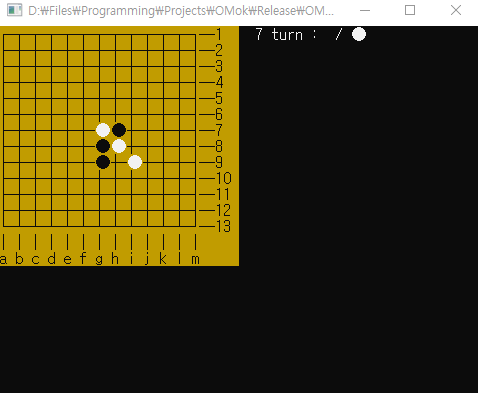

# Omok
### Description

Omok, also called Five in a Row, is an abstract strategy board game. It is traditionally played with Go pieces (black and white stones) on a Go board. It can be played using the 15×15 board or the 19×19 board. Because pieces are typically not moved or removed from the board, Gomoku may also be played as a paper-and-pencil game. The game is known in several countries under different names.

Players alternate turns placing a stone of their color on an empty intersection. The winner is the first player to form an unbroken chain of five stones horizontally, vertically, or diagonally.

- **Coder** : Hanbuel Dean Cho
- **Language** : c++

- **since**: Nov.04.2019

